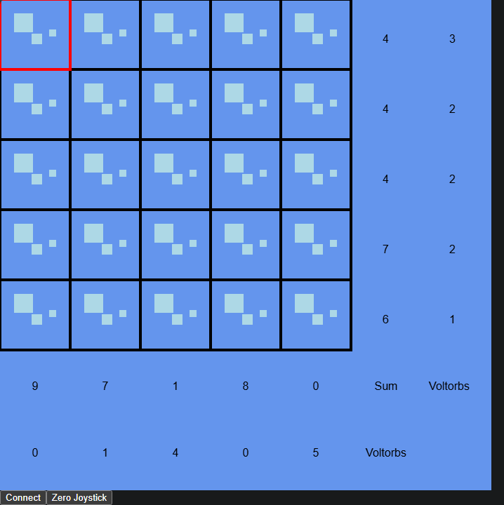
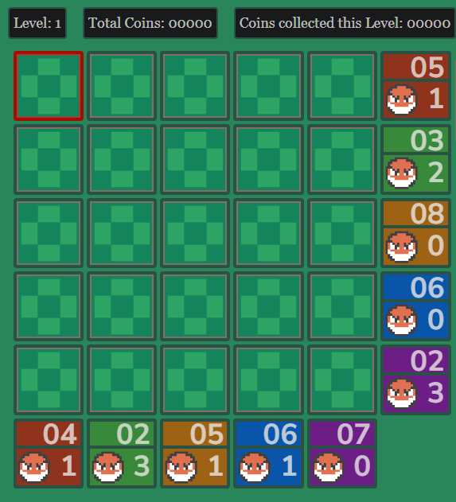
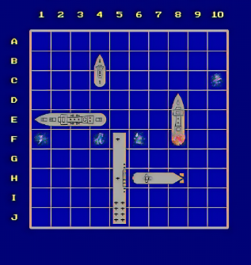

# 🎮 Voltorb Flip with Arduino & p5.js

An interactive hardware/software version of the classic **Voltorb Flip** game, combining **p5.js**, **Tone.js**, and **Arduino** with a joystick-controlled grid interface.

---

## 🧩 Project Overview

This project recreates the logic of *Voltorb Flip* with a physical twist. Players use a joystick (connected to an Arduino) to navigate a grid rendered in **p5.js**. Flipping tiles reveals either a score multiplier (2 or 3), a 1, or a Voltorb — which ends the game for that tile.

### 🎯 Objectives
- Use joystick input to control a visual game grid.
- Integrate audio feedback with **Tone.js**.
- Communicate between p5.js and Arduino using **Web Serial API**.
- Enhance interactivity with LED feedback from the Arduino.

---

## 📽️ Demo

**🎥 Video Walkthrough:**  

---

## 🖼️ Screenshots

### Game Interface  

### Game Interface Inspiration  

---

## 🔌 Schematics

### Joystick Wiring
- X-axis → A0
- Y-axis → A1
- Switch (button press) → D2
- VCC → 5V
- GND → GND

---

## 🧠 How It Works

- The grid is initialized with randomized tile values: 1s, 2s, 3s, and Voltorbs (bombs).
- Joystick input controls the red-highlighted cursor.
- Pressing the joystick button flips a tile:
  - If it’s a Voltorb, a low-tone plays and the red LED turns on.
  - If it’s 2 or 3, a higher-tone plays and the green LED turns on.
- Row and column hints show how many points and Voltorbs are present in each row/column.

--

## 🛠️ Tech Stack

- 🧠 **p5.js** – Game rendering & logic  
- 🎧 **Tone.js** – Sound synthesis  
- 🧲 **Arduino** – Hardware joystick + LED feedback  
- 🔌 **Web Serial API** – Arduino ↔ Browser communication  

---

## 🚀 Future Development Ideas

- Fix Issues with the latency of the joystick
- Add animations for the card flips and the voltorbs (bombs) exploding
- Game over / win screen
- Restart or reset functionality
- Scorekeeping & difficulty levels
- Host playable version on GitHub Pages

---

